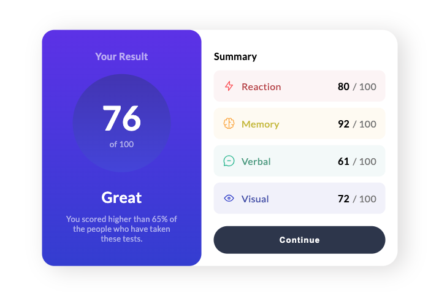

# Frontend Mentor - Results summary component solution

This is a solution to the [Results summary component challenge on Frontend Mentor](https://www.frontendmentor.io/challenges/results-summary-component-CE_K6s0maV). Frontend Mentor challenges help you improve your coding skills by building realistic projects.

## Table of contents

- [Overview](#overview)
  - [The challenge](#the-challenge)
  - [Screenshot](#screenshot)
  - [Links](#links)
- [My process](#my-process)
  - [Built with](#built-with)
  - [What I learned](#what-i-learned)
  - [Continued development](#continued-development)
- [Author](#author)
- [Acknowledgments](#acknowledgments)

## Overview

### The challenge

Users should be able to:

- View the optimal layout for the interface depending on their device's screen size
- See hover and focus states for all interactive elements on the page

### Screenshot

### Links

- Live Site URL: [https://results-summary-component-gilt.vercel.app/](https://results-summary-component-gilt.vercel.app/)

## My process

### Built with

- Semantic HTML5 markup
- CSS custom properties
- Flexbox

### What I learned

I learned a few things while building this, both from the UI design and developer perspective.

On the UI Design side, I saw how one can use opacity to create a muted title instead of grey when text is on top of a gradient. I also liked the effect of reversing the gradient with the circle to create the illusion of an indent. The use of colors in the summary section was surprising. I liked how there was a palette for each skill, and the use of a lighter color background complemented with the darker color text and logo. Though, I do wonder if the contrast may be too little for accessibility purposes.

On the coding side, I found myself reaching for flexbox every time I needed to add spacing between elements. However, I had to restrain myself and think about whether it was truly needed. Oftentimes, stacking elements with some margins was enough considering the fixed height of the container. I'm sure flexbox would've been more useful with a responsive container.

### Continued development

I'd like to look further into responsive text styling. Currently, I used a lot of pixel-based values to get the correct look. However, I know that there are 'em' and 'rem' units. These could help me set one size and automatically scale the text based on the screen size.

## Author

- Website - [Khalid Ali](https://codingkhareed.dev/)

## Acknowledgments

Thank you god for giving me the opportunity and ability to complete this project.
